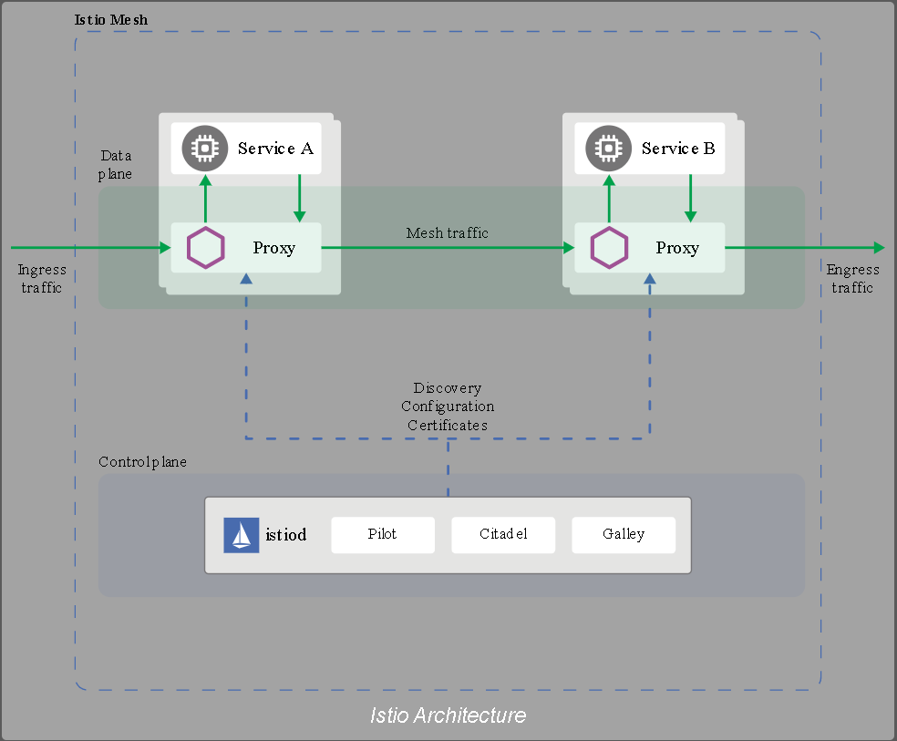
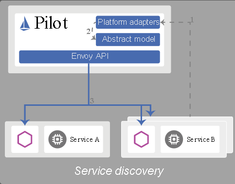

stio服务网格在逻辑上分为数据平面和控制平面。

- 数据平面由一组部署为边车的智能代理(Envoy)组成。这些代理负责协调和控制微服务之间的所有网络通信。他们还收集和报告所有网格流量的遥测数据。

- 控制平面管理并将代理配置为路由流量。

下图显示了构成每个平面的不同组件：（下图来自官网）

Istio中的交通分为数据平面交通和控制平面交通。数据平面流量是指工作负载的业务逻辑发送和接收的消息。控制平面交通是指在Istio组件之间发送的配置和控制消息来对网格的行为进行编程。Istio中的流量管理专门指数据平面流量。

#### 1. 组件

##### 1.1 Envoy
Istio使用Envoy代理的扩展版本。Envoy是用c++开发的高性能代理，用于协调服务网格中所有服务的所有入站和出站流量。Envoy代理是唯一与数据通信交互的Istio组件。

Envoy代理被部署为服务的边车，从逻辑上讲，它增加了Envoy的许多内置特性：

- Dynamic service discovery

- Load balancing

- TLS termination

- HTTP/2 and gRPC proxies

- Circuit breakers

- Health checks

- Staged rollouts with %-based traffic split

- Fault injection

- Rich metrics

这种sidecar部署允许Istio提取大量关于流量行为的信号作为属性。Istio可以使用这些属性来执行策略决策，并将它们发送到监控系统，以提供关于整个网格的行为的信息。

sidecar代理模型还允许您向现有部署添加Istio功能，而不需要重新架构或重写代码。

由envoy代理启用的一些Istio功能和任务包括:

- Traffic control features: enforce fine-grained traffic control with rich routing rules for HTTP, gRPC, WebSocket, and TCP traffic.

- Network resiliency features: setup retries, failovers, circuit breakers, and fault injection.

- Security and authentication features: enforce security policies and enforce access control and rate limiting defined through the configuration API.

- Pluggable extensions model based on WebAssembly that allows for custom policy enforcement and telemetry generation for mesh traffic.

#####  1.2 Pilot
Pilot针对提供智能路由（比如，A/B测试、金丝雀部署）的Envoy Sidecar，流量管理的能力提供了服务发现。针对弹性提供了超时，重试，断路保护等功能。

Pilot将控制流量行为的高级路由规则转换为特定于环境的配置，并在运行时将它们传播到边车。Pilot将特定于平台的服务发现机制抽象出来，并将它们合成为任何符合Envoy API的sidecar都可以使用的标准格式。

下图显示了平台适配器和Envoy代理如何交互:

1. 平台启动一个服务的新实例，该实例通知其平台适配器。

2. 平台适配器使用Pilot抽象模型注册实例。

3. Pilot将分发流量规则和配置给Envoy代理，以说明更改的原因。

这种耦合允许istio运行在比如kubernetes、Consul或者Nomad等平台上。

##### 1.3 Citadel
Citadel支持强大的服务对服务和终端用户身份验证，内置身份和凭证管理。您可以使用Citadel来升级服务网格中的未加密流量。使用Citadel，运营商可以执行基于服务身份的策略，而不是基于相对不稳定的第3层或第4层网络标识符。从0.5版开始，您可以使用Istio的授权特性来控制谁可以访问您的服务。

##### 1.4 Gallery
Galley是Istio的配置验证、注入、处理和分发组件。它负责将其余的Istio组件与从底层平台(例如Kubernetes)获取用户配置的细节隔离开来。

#### 2. 设计目标
- 最大化的透明度：为了采用Istio，操作人员或开发人员需要做尽可能少的工作，才能从系统中获得真正的价值。为此，Istio可以自动将自己注入到服务之间的所有网络路径中。Istio使用sidecar代理来捕获流量，并在可能的情况下，在不更改已部署的应用程序代码的情况下，自动对网络层进行编程，以通过这些代理路由流量。在Kubernetes中，代理被注入到pods中，通过编写iptables规则捕获流量。一旦sidecar代理被注入并且流量路由被处理，Istio可以协调所有的流量。这个原则也适用于性能。当将Istio应用于部署时，操作人员会看到所提供功能的资源成本的最小增加。组件和api的设计必须考虑到性能和可伸缩性。

- 扩展性：随着操作人员和开发人员越来越依赖于Istio提供的功能，系统必须随着他们的需求而增长。当我们继续添加新特性时，最大的需求是扩展策略系统的能力，与其他策略和控制源的集成，以及将关于网格行为的信号传播到其他系统进行分析的能力。策略运行时支持用于插入其他服务的标准扩展机制。

- 可移植性：使用Istio的生态系统在许多方面都有所不同。Istio必须在任何云环境或本地环境中以最小的努力运行。将基于isti的服务移植到新环境的任务必须是琐碎的。使用Istio，您可以操作部署到多个环境中的单个服务。例如，可以在多个云上部署冗余。

- 策略的一致性：策略在服务之间的API调用上的应用提供了对网格行为的大量控制。然而，将策略应用于API级别上不一定表示的资源也同样重要。例如，对ML训练任务消耗的CPU数量应用配额比对发起工作的调用应用配额更有用。为此，Istio使用自己的API将策略系统维护为一个独立的服务，而不是将策略系统集成到代理sidecar中，从而允许服务根据需要直接与之集成。