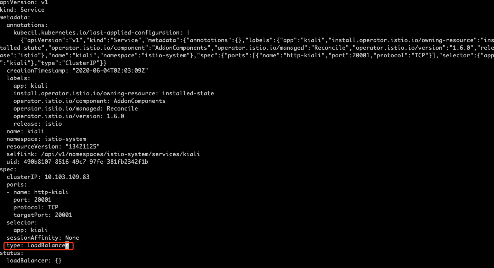
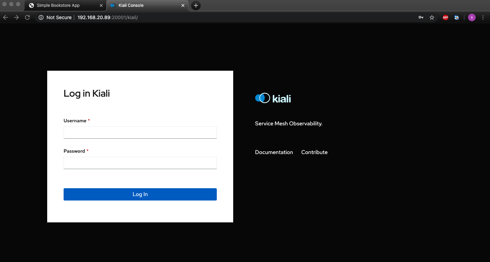

#### 1. 部署案例应用

1. 部署Bookinfo的案例应用

```shell
$ kubectl apply -f samples/bookinfo/platform/kube/bookinfo.yaml
```

2. 当每个pod准备就绪后，Istio sidecar也会随之展开。

```shell
$ kubectl get service
$ kubectl get pods
```

3. 校验所有的工作是否正常

```shell
$ kubectl exec -it $(kubectl get pod -l app=ratings -o jsonpath='{.items[0].metadata.name}') -c ratings -- curl productpage:9080/productpage | grep -o "<title>.*</title>"
```

#### 2. 打开应用给外面访问
1. Bookinfo应用程序已部署，但不能从外部访问。要使其可访问，您需要创建一个Istio Ingress网关，它将路径映射到网格边缘的一个路由，

```shell
$ kubectl apply -f samples/bookinfo/networking/bookinfo-gateway.yaml
```

2. 查看创建的gateway

```shell
$ kubectl get gateway
```

#### 3. 确定ingress的IP和端口号

1. 查看Ingress-gateway服务的IP和端口

```shell
$ kubectl get svc istio-ingressgateway -n istio-system

NAME                   TYPE           CLUSTER-IP    EXTERNAL-IP     PORT(S)                                                                                                                                      AGE
istio-ingressgateway   LoadBalancer   10.96.29.94   192.168.20.88   15020:30714/TCP,80:32518/TCP,443:32721/TCP,15029:31316/TCP,15030:30930/TCP,15031:32012/TCP,15032:31724/TCP,31400:31016/TCP,15443:31582/TCP   71m
```

>[info] 从上面的信息可以看出服务的IP为`192.168.20.88`, 接下来进行访问测试我们部署的应用。

2. 在浏览器中访问`http://192.168.20.88/product-page`校验访问


#### 4. 在Dashboard中查捍安装的应用

Istio通过演示安装安装了几个可选的仪表板。Kiali仪表板通过显示拓扑并指示网格的健康状况，帮助您了解服务网格的结构。

1. 修改kiali的服务，类型为LoadBalancer.

```shell
# 执行如下命令，编辑kiali的服务
[root@c72082 istio-1.6.0]# kubectl edit svc kiali -n istio-system

# 把type: cluster 改为 LoadBalancer
```


2. 再次查看服务

```shell
$ kubectl get svc kiali -n istio-system

NAME    TYPE           CLUSTER-IP      EXTERNAL-IP     PORT(S)           AGE
kiali   LoadBalancer   10.101.155.85   192.168.20.89   20001:30445/TCP   80m
```

3. 使用浏览器访问`http://192.168.20.89:20001/kiali/`，访问结果如下所示：


- 初始用户名和密码均为`admin`


#### 5. 移除

- Istio uninstall将分层次删除在Istio -system名称空间下的RBAC权限和所有资源。忽略不存在的资源的错误是安全的，因为它们可能是分层删除的。

```shell
$ istioctl manifest generate --set profile=demo | kubectl delete -f -
```

- `istio-system` 的名称空间默认不会删除的，假如不再需要的话，执行如下命令进行删 除。

```shell
$ kubectl delete namespace istio-system
```