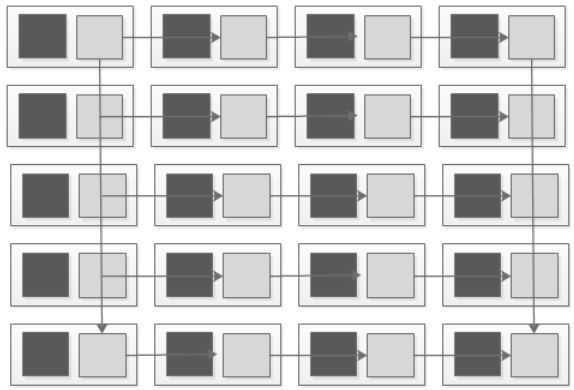

#### 1. 服务网格定义
服务网格是一个专注于处理服务间通信的基础设施层，它负责在现代云原生应用组成的复杂服务拓扑中可靠地传递请求。

1. 服务网格特点如下：

- 轻量级的网络代理

- 应用无感知

- 应用之间的流量由服务网格接管

- 服务间的调用可能出现的超时、重试、监控、追踪等工作下沉到服务网格层处理。

如下图所示： 深色代表应用，清灰色代表网格中轻量级的网络代理。代理之间可以相互通信，而应用之间的通信完全由代理来进行。如果只看代理部分，可以看到一个网状结构，服务网格由此得名。

网格一般由数据平面和控制平面组成，数据平面负责在服务中部署一个称为“边车”（sidecar）的请求代理，控制平面负责请求代理之间的交互，以及用户与请求代理的交互。

#### 2. 服务网格优势
随着服务数量增长，每个服务都需要自己管理复杂的服务间的网络通信，也让开发人员头疼。也变得越来难以管理，这要求服务治理包含很多功能。例如：服务发现、负载均衡、故障转移、服务度量指标收集和监控等。