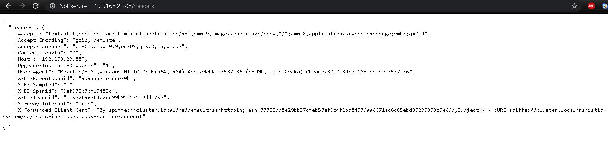

在kubernetes环境中,`kubernetes Ingress Resource`常用来指定应该暴露给集群外部的服务。在一个Istio的服务网格中，最好的办法就是使用不同的配置模型，也就是`Istio Gateway`。一个`gateway`允许Istio的功能，比如监控和路由规则去应用到进入集群的流量 。

本小节描述如何配置Istio去暴露服务到服务网格的外部。

#### 1. 准备工作
- 如果开启了sidecar的自动注入，那么执行如下

```shell
$ kubectl apply -f samples/httpbin/httpbin.yaml
```

- 否则使用如下命令手工注入sidecar

```shell
$ kubectl apply -f <(istioctl kube-inject -f samples/httpbin/httpbin.yaml)
```

#### 2. 确定Ingress的IP和端口

- 执行下面命令，查看你的istio-ingressgateway服务是不是使用负载均衡器

```shell
$ kubectl get svc istio-ingressgateway -n istio-system
```

- 使用以下命令查看端口和IP

```shell
$ export INGRESS_HOST=$(kubectl -n istio-system get service istio-ingressgateway -o jsonpath='{.status.loadBalancer.ingress[0].ip}')

$ export INGRESS_PORT=$(kubectl -n istio-system get service istio-ingressgateway -o jsonpath='{.spec.ports[?(@.name=="http2")].port}')

$ export SECURE_INGRESS_PORT=$(kubectl -n istio-system get service istio-ingressgateway -o jsonpath='{.spec.ports[?(@.name=="https")].port}')
```

#### 3. 使用Istio gateway配置ingress
入口网关描述了一个运行在网格边缘的负载均衡器，它接收传入的HTTP/TCP连接。它配置暴露的端口、协议等，但与Kubernetes进入资源不同，它不包含任何流量路由配置。入口流量的流量路由是使用Istio路由规则配置的，其方式与内部服务请求完全相同。

1. 创建Istio Gateway:

```shell
$ kubectl apply -f - <<EOF
apiVersion: networking.istio.io/v1alpha3
kind: Gateway
metadata:
  name: httpbin-gateway
spec:
  selector:
    istio: ingressgateway # use Istio default gateway implementation
  servers:
  - port:
      number: 80
      name: http
      protocol: HTTP
    hosts:
    - "httpbin.example.com"
EOF
```

2. 通过gateway配置进入的流量

```shell
$ kubectl apply -f - <<EOF
apiVersion: networking.istio.io/v1alpha3
kind: VirtualService
metadata:
  name: httpbin
spec:
  hosts:
  - "httpbin.example.com"
  gateways:
  - httpbin-gateway
  http:
  - match:
    - uri:
        prefix: /status
    - uri:
        prefix: /delay
    route:
    - destination:
        port:
          number: 8000
        host: httpbin
EOF

```

3. 使用curl访问httpbin的服务

```shell
$ curl -I -HHost:httpbin.example.com http://$INGRESS_HOST:$INGRESS_PORT/status/200
```

在这里-H选项是设置主机的HTTP报头为`httpbin.example.com`

4. 访问其它的URL，应该会看到一个HTTP 404错误。

```shell
$ curl -I -HHost:httpbin.example.com http://$INGRESS_HOST:$INGRESS_PORT/headers
```

#### 4. 使用浏览器访问ingress服务

>[warning]由于没有配置针对域名和IP相对应的DNS服务，所以当用浏览器访问 https://httpbin.example.com/status/200 时可能无法访问。为了能够使基于IP的能够工作，特配置如下：

```shell
kubectl apply -f - <<EOF
apiVersion: networking.istio.io/v1alpha3
kind: Gateway
metadata:
  name: httpbin-gateway
spec:
  selector:
    istio: ingressgateway # use Istio default gateway implementation
  servers:
  - port:
      number: 80
      name: http
      protocol: HTTP
    hosts:
    - "*"
---
apiVersion: networking.istio.io/v1alpha3
kind: VirtualService
metadata:
  name: httpbin
spec:
  hosts:
  - "*"
  gateways:
  - httpbin-gateway
  http:
  - match:
    - uri:
        prefix: /headers
    route:
    - destination:
        port:
          number: 8000
        host: httpbin
EOF

```


- 测试结果如下所示：


网关配置资源允许外部流量进入Istio服务网格，使Istio的流量管理和策略特性可用于边缘服务。

#### 5. 排错
1. 检查`INGRESS_HOST`和`INGRESS_PORT`环境变量，根据下面命令的输出，确认一下你是否有有效的值。

```shell
$ kubectl get svc -n istio-system
$ echo INGRESS_HOST=$INGRESS_HOST, INGRESS_PORT=$INGRESS_PORT
```

2. 确保在相同的端口上你没有其它的Istio ingress gateways的定义

```shell
$ kubectl get gateway --all-namespaces
```

3. 检查你没有在相同的IP和端口上定义其它的kubernetes Ingress资源

```shell
$ kubectl get ingress --all-namespaces
```

#### 6. 清空本节课程实验

```shell
$ kubectl delete gateway httpbin-gateway
$ kubectl delete virtualservice httpbin
$ kubectl delete --ignore-not-found=true -f samples/httpbin/httpbin.yaml
```