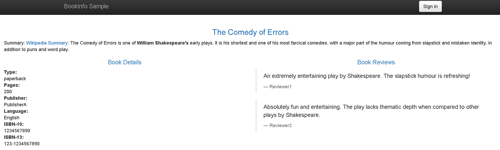
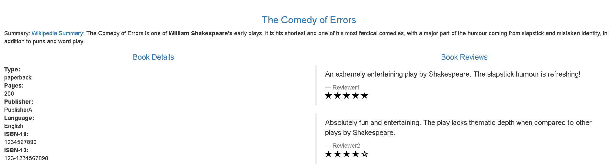

该任务展示了如何路由请求，来动态的到一个微服务的多个版本。

#### 1. 开始准备工作
1. 安装Istio
2. 部署Bookinfo的案例应用
3. 充分掌握前面的说的原理，及熟悉`destionation rule`，`virtual service`和`subnet`.

#### 2. 关于该任务

istio `Bookinfo`案例包含4个微服务，其中`reviews`有三个不同的版本。要说明这导致的问题，在浏览器中访问Bookinfo应用程序的/productpage并刷新几次。你会注意到，有时书评输出包含星级评级，有时不包含。这是因为如果没有显式的默认服务版本来路由，Istio就会以循环的方式将请求路由到所有可用的版本。

此任务的初始目标是应用将所有流量路由到微服务的v1(版本1)的规则。稍后，您将根据HTTP请求头的值将规则应用于路由流量。

#### 1. 应用虚拟服务
要仅路由到一个版本，需要应用虚拟服务来设置微服务的默认版本。在这种情况下，虚拟服务将把所有流量路由到每个微服务的v1。

1. 应用默认的目标规则

```shell
$ kubectl apply -f samples/bookinfo/networking/destination-rule-all.yaml
```

2. 显示目标规则

```shell
$ kubectl get destinationrules -o yaml
```

3. 运行下面命令应用虚拟服务

```shell
$ kubectl apply -f samples/bookinfo/networking/virtual-service-all-v1.yaml
```

因为配置传播最终是一致的，所以请等待几秒钟，等待虚拟服务生效。

4. 使用如下命令显示定义的路由

```shell
$ kubectl get virtualservices -o yaml
```

5. 使用如下命令查看子集的定义

```shell
$ kubectl get destinationrules -o yaml
```

#### 2. 测试新路由配置

测试结果如下：



#### 3. 基于用户的标识进行路由

接下来，您将更改路由配置，以便将来自特定用户的所有流量路由到特定的服务版本。在本例中，来自一个名为Jason的用户的所有流量将被路由到`reviews:v2`。

1. 运行以下的命令开启基于用户的路由

```shell
$ kubectl apply -f samples/bookinfo/networking/virtual-service-reviews-test-v2.yaml 
```

2. 使用以下命令确定规则的创建

```shell
$ kubectl get virtualservice reviews -o yaml
```

3. 测试结果如下：




#### 4. 理解发生了什么？
在该任务中，刚开始发送100%的流量到Bookinfo中的每个服务，然后我们设置了基于`end-user`报头来发送流量到reviews的v2版本。


#### 4. 清空本次试验

```shell
$ kubectl delete -f samples/bookinfo/networking/virtual-service-all-v1.yaml
```