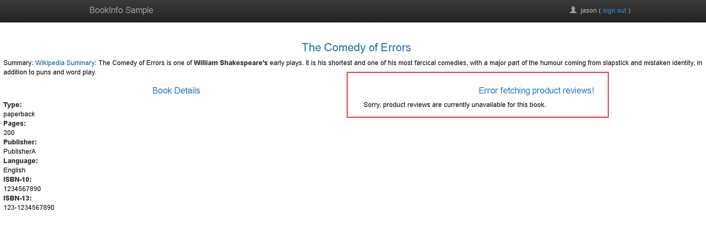
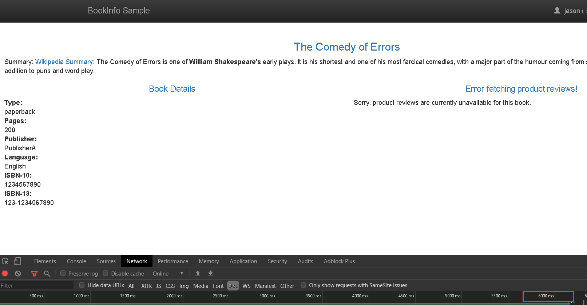
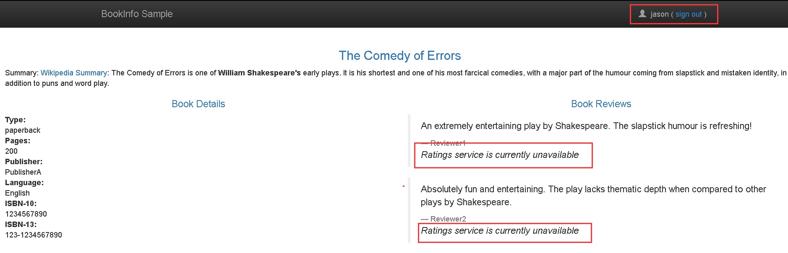

本小节演示如何通过故障注入来测试应用的弹性。

#### 1. 准备工作

1. 应用如下

```shell
# 使用下面的配置，请求流如下：
# productpage → reviews:v2 → ratings (only for user jason)
# productpage → reviews:v1 (for everyone else)
$ kubectl apply -f samples/bookinfo/networking/virtual-service-all-v1.yaml
$ kubectl apply -f samples/bookinfo/networking/virtual-service-reviews-test-v2.yaml
```

#### 2. 注入HTTP的延迟故障
为了测试Bookinfo应用程序微服务的弹性，在`reviews:v2`和针对用户`jason`的`ratings`之间插入7s的延迟。这个测试将发现一个故意引入Bookinfo应用程序的bug。

请注意`reviews:v2`服务有一个10s硬编码连接超时来调用`ratings`服务。即使您引入了7s延迟，您仍然希望端到端流能够继续，而不会出现任何错误。

1. 创建一个故障注入的规则来延迟来自`jason`用户的流量。

```shell
$ kubectl apply -f samples/bookinfo/networking/virtual-service-ratings-test-delay.yaml
```

2. 确认创建的规则

```shell
$ kubectl get virtualservice ratings -o yaml
```

#### 3. 测试延迟的配置

1. 打开/productpage页面，使用jason用户登陆，如下所示：


2. 查看web页面的响应时间
	1. 在浏览器中打开开发工具菜单
	2. 查看实际的加载时间大约需要6s
	

#### 4. 明白发生了什么
你发现了一个bug。微服务中存在硬编码的超时，导致`reviews`服务失败。

正如预期的那样，您引入的7s延迟并不影响`reviews`服务，因为`reviews`和`ratings`服务之间的超时时间是硬编码为10s。然而，在`productpage`页面和`reviews`服务之间也有一个硬编码超时，编码为3s + 1次重试，共6s。因此，调用productpage来检查超时时间过早，并在6s之后抛出错误。

这样的bug可能出现在典型的企业应用程序中，其中不同的团队独立地开发不同的微服务。Istio的故障注入规则可以帮助您在不影响最终用户的情况下识别这些异常。

#### 4. 修复bug
通常通过以下方式解决问题：
1. 增加`productpage`到`reviews`服务的超时或者减少`reviews`到`ratings`的超时。
2. 停止和重启修复的微服务。
3. 确认`/productpage`web页面返回它的响应且没有任何错误。

然而，在`reviews` v3中已经修复了那个bug，这个`reviews:v3`服务减少了`reviews`到`ratings`的超时，从10s减少到了2.5s，因此它兼容下游`productpage`的请求。

#### 5. 注入HTTP的终止错误
测试微服务弹性的另一种方法是引入HTTP异常中止。在这个任务中，您将为测试用户jason的ratings微服务引入一个HTTP中止。

在这种情况下，您期望页面立即加载并显示`ratings`服务当前不可用的消息。

1. 发送一个针对`jason`用户故障注入的HTTP终止类型

```shell
$ kubectl apply -f samples/bookinfo/networking/virtual-service-ratings-test-abort.yaml
```

2. 确认创建的规则

```shell
$ kubectl get virtualservice ratings -o yaml
```

#### 6. 确认终止的配置



#### 7. 清除本课的路由规则

```shell
$ kubectl delete -f samples/bookinfo/networking/virtual-service-all-v1.yaml
```