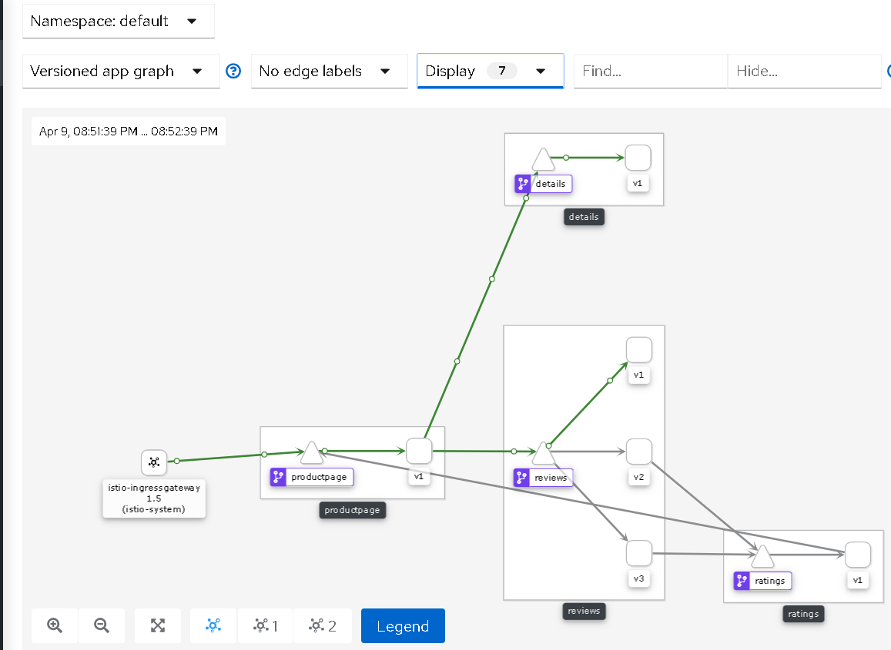

这个任务向您展示了如何逐步地将流量从微服务的一个版本迁移到另一个版本。例如，您可以将流量从旧版本迁移到新版本。

一个常见的用例是将流量从微服务的一个版本逐渐迁移到另一个版本。在Istio中，您可以通过配置一系列规则来实现这一目标，这些规则将一定比例的流量路由到一个或另一个服务。在这个任务中，您将50%的流量发送给评审:v1, 50%发送给评审:v3。然后，您将通过向reviews:v3 发送100%的流量来完成迁移。

#### 1. 应用基于权重的路由

1. 运行以下的命令去路由所有的流量到每个微服务的v1版本。

```shell
$ kubectl apply -f samples/bookinfo/networking/virtual-service-all-v1.yaml
```

2. 打开浏览器进行测试，应该会发现，始终访问的是v1版本的微服务。




3. 从`reviews:v1`转移50%的流量到`reviews:v3`

```shell
$ kubectl apply -f samples/bookinfo/networking/virtual-service-reviews-50-v3.yaml
```

4. 确认创建的规则

```shell
$ kubectl get virtualservice reviews -o yaml
```

5. 测试结果如下所示：


6. 现在把所有的流量都切换到v3版本。

```shell
$ kubectl apply -f samples/bookinfo/networking/virtual-service-reviews-v3.yaml
```

7. 测试结果如下


8. 移除应用路由规则

```shell
$ kubectl delete -f samples/bookinfo/networking/virtual-service-all-v1.yaml
```