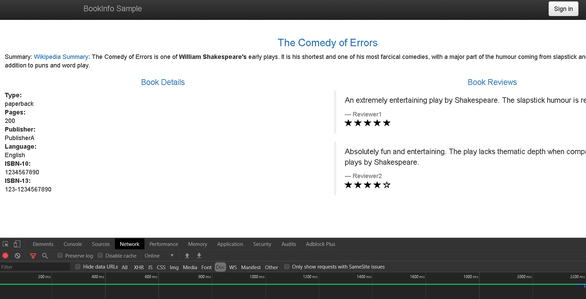

#### 1. 准备工作
- 运行以下命令初始化版本的路由

```shell
$ kubectl apply -f samples/bookinfo/networking/virtual-service-all-v1.yaml
```

#### 2. 请求超时
针对http的请求超时，可以使用路由规则中的`timeout`字段。默认timeout是关闭的。但是在此任务中，设置reviews服务的超时时间为1秒。为了查看它的影响，我们还可以在调用ratings服务的时候引进一个2秒的延迟。


1. 路由请求到`reviews`的v2版本。

```shell
kubectl apply -f - <<EOF
apiVersion: networking.istio.io/v1alpha3
kind: VirtualService
metadata:
  name: reviews
spec:
  hosts:
    - reviews
  http:
  - route:
    - destination:
        host: reviews
        subset: v2
EOF

```

2. 路由请求到`ratings`服务，添加2秒的延迟。

```shell
kubectl create -f - <<EOF
apiVersion: networking.istio.io/v1alpha3
kind: VirtualService
metadata:
  name: ratings
spec:
  hosts:
  - ratings
  http:
  - fault:
      delay:
        percent: 100
        fixedDelay: 2s
    route:
    - destination:
        host: ratings
        subset: v1
EOF

```

3. 打开浏览器`http://$GATEWAY_URL/productpage`,应该能看到Bookinfo的应用工作正常，但你刷新页面时，它会有2秒的延迟。

4. 现在针对调用`reviews`服务添加0.5秒的延迟。

```shell
kubectl apply -f - <<EOF
apiVersion: networking.istio.io/v1alpha3
kind: VirtualService
metadata:
  name: reviews
spec:
  hosts:
  - reviews
  http:
  - route:
    - destination:
        host: reviews
        subset: v2
    timeout: 0.5s
EOF

```

现在，您应该看到它在大约1秒(而不是2秒)后返回，并且`reviews`不可用

即使超时配置为半秒，响应也需要1秒，这是因为在productpage服务中有一个硬编码的重试，所以它在返回之前会两次调用计时的 reviews服务。



#### 3. 理解发生了什么？
在此任务中，使用istio针对调用`reviews`微服务的请求超时时间设置为半秒。 但是默认的请求超时是关闭的。 因此当`reviews`服务去调用`ratings`服务时，而我们设置的调用超时时间为2秒。这就导致了`reviews`的微服务超时，因为2秒大于它本身设置的0.5秒。

仔细观察`reviews`服务页面显示，你就会发现`Sorry, product reviews are currently unavailable for this book.`.这其实就是从`reviews`服务收到的结果。

如果你要仔细检查`故障注入`,你会发现`productpage`微服务去调用`reviews`微服务也有它相应的应用级别超时。


#### 4. 清除本实验

```shell
$ kubectl delete -f samples/bookinfo/networking/virtual-service-all-v1.yaml
```