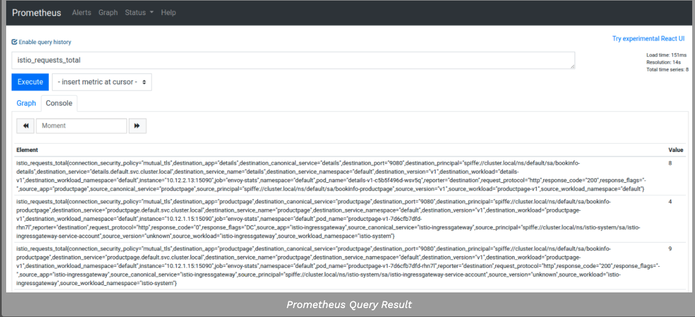
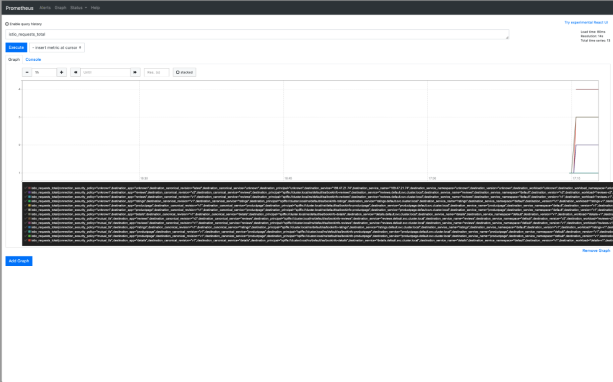

本任务向您展示如何使用Prometheus查询Istio指标。作为该任务的一部分，您将使用基于web的接口来查询metric值。

在整个任务中，Bookinfo示例应用程序用作示例应用程序。

#### 1. 查询istio度量值

1. 使用如下命令校验运行的Prometheus服务

```shell
$ kubectl -n istio-system get svc prometheus
```

2. 在你的浏览器中访问 http://$GATEWAY_URL/productpage，或者使用如下命令

```shell
$ curl http://$GATEWAY_URL/productpage
```

3 . 在k8s的环境中，执行如下打开prometheus UI

```shell
$ istioctl dashboard prometheus
```

4. 执行prometheus查询

```shell
$ istio_requests_total
```

结果如下所示：





5. 尝试其它的查询

- 查询到productpage服务的所有请求总数

```shell
istio_requests_total{destination_service="productpage.default.svc.cluster.local"}
```

- 查询到reviews v3版本的所有请求总数

```shell
istio_requests_total{destination_service="reviews.default.svc.cluster.local", destination_version="v3"}
```

- 过去5分钟内对productpage服务的所有实例的请求率

```shell
rate(istio_requests_total{destination_service=~"productpage.*", response_code="200"}[5m])
```

#### 2. 关于Prometheus的附加组件

预配置的普罗米修斯插件是一个普罗米修斯服务器到刮Istio端点收集度量标准。它提供了一个机制来持久存储和查询的Istio指标。

#### 3. 清除本实验

```shell
$ killall istioctl
```