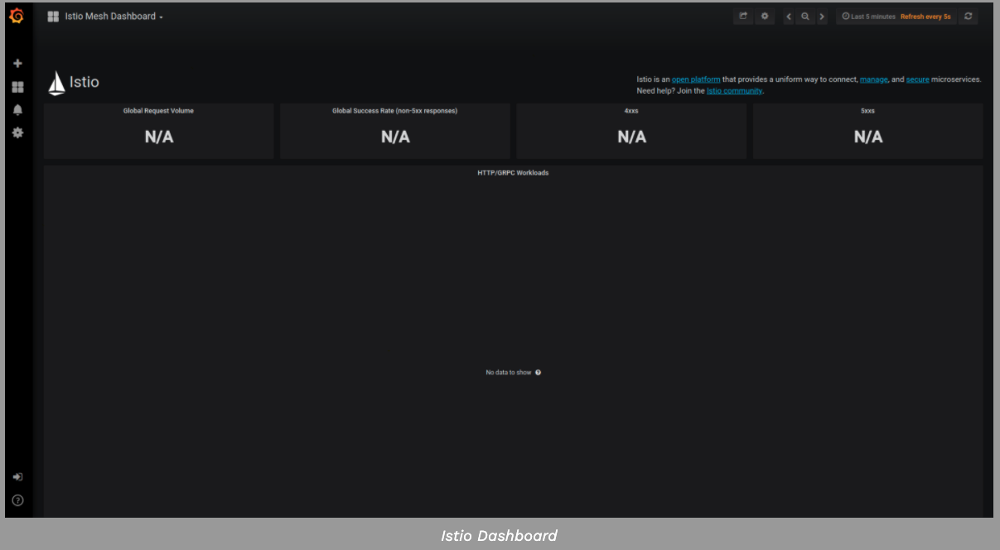

本任务向您展示如何设置和使用Istio仪表板来监视网格流量。作为该任务的一部分，您将使用Grafana Istio addon和基于web的界面来查看服务网格流量数据。

本案例还是使用Bookinfo的案例应用。

#### 1. 准备工作

- Install Istio in your cluster. If not enabled in your chosen configuration profile, enable the Grafana addon --set values.grafana.enabled=true option.

- Deploy Bookinfo application.

#### 2. 查看Istio 的Dashborad

1. 查看Prometheus和grafana的服务是否处于运行

```shell
$ kubectl -n istio-system get svc prometheus

$ kubectl -n istio-system get svc grafana

```

2. 在k8s的环境中，执行如下命令打开Istio Dashboard

```shell
$ kubectl -n istio-system port-forward $(kubectl -n istio-system get pod -l app=grafana -o jsonpath='{.items[0].metadata.name}') --address=0.0.0.0 3000:3000 &
```

在你的浏览器访问： http://localhost:3000/dashboard/db/istio-mesh-dashboard 

Istio Dashboard看起来如下所示：



3. 在浏览中访问http://$GATEWAY_URL/productpage 或者使用如下命令

```shell
$ curl http://$GATEWAY_URL/productpage
```

刷新页面几次再来看Dashboard,如下所示：


4. 可视化服务的Dashboards

Grafana仪表板的左手角落导航菜单,你可以导航到Istio服务指示板或访问http://localhost: 3000/dashboard/db/istio-service-dashboard在您的web浏览器。


5. 可视化工作流的Dashboard

Grafana仪表板的左手角落导航菜单,你可以导航到Istio工作量仪表板或访问http://localhost:3000/dashboard/db/istio-workload-dashboard


#### 3. 清除本实验

```shell
$ ps aux | grep kubectl  #查询kubectl运行的后端进程

$ kill -9 pid
```