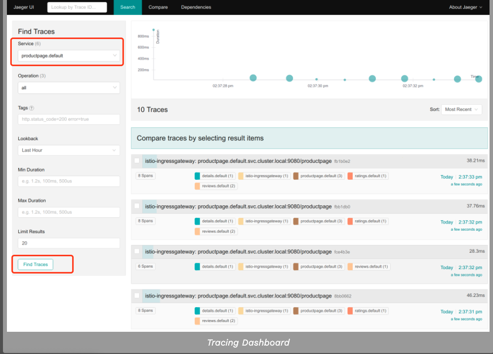
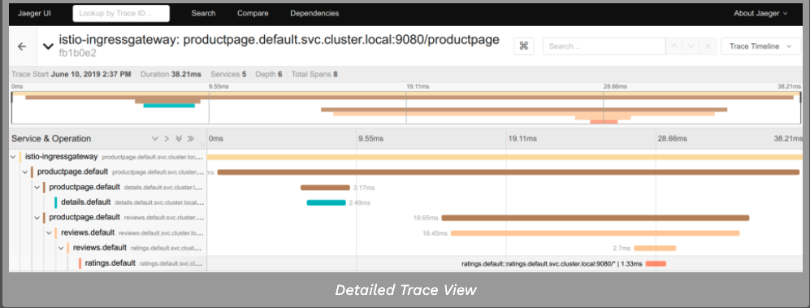

完成此任务后，您将了解如何让应用程序参与Jaeger的跟踪，而不管用于构建应用程序的语言、框架或平台。

该任务使用Bookinfo示例作为示例应用程序。

#### 1. 准备工作

1. 去构建Istio，在安装指南中遵循以下指令，然后配置

- 通过设置`--set values.tracing.enabled=true`安装选项开启追踪的开箱即用在demo/test 环境。

- 在生产环境中通过引用已存在的Jaeger实例，比如创建一个Operator, [Jaeger参考链接](https://github.com/jaegertracing/jaeger-operator "Jaeger参考链接")， 然后设置`--set values.global.tracer.zipkin.address=<jaeger-collector-service>.<jaeger-collector-namespace>:9411` 安装选项。

2. 部署Bookinfo案例

```shell
$ kubectl label namespace default istio-injection=enabled
$ kubectl apply -f samples/bookinfo/platform/kube/bookinfo.yaml
$ kubectl get services
$ kubectl get pods
$ kubectl exec -it "$(kubectl get pod -l app=ratings -o jsonpath='{.items[0].metadata.name}')" -c ratings -- curl productpage:9080/productpage | grep -o "<title>.*</title>"
```

#### 2. 访问Dashboard

针对测试，你可能会使用端口转发，假如你部署了Jager到istio-system名称空间。

```shell
$ istioctl dashboard jaeger
```

#### 3. 使用Bookinfo案例产生追踪

1. 当Bookinfo应用处于运行状态时，访问`http://$GATEWAY_URL/productpage` 一次或更多次去产生追踪信息

去查看追踪数据，你必须发送请求到你的服务， 这请求的数量依靠于你Istio的案例速率 是当安装istio的时候设置的，默认的速率是1%。 在第一次追踪可见之前你需要至少发送100个请求。 使用如下命令，发送100个请求到productpage服务。

```shell
$ for i in `seq 1 100`; do curl -s -o /dev/null http://$GATEWAY_URL/productpage; done
```

2. 然后通过Dashboard查看如下所示


3. 单击顶部的最新跟踪，查看与/productpage的最新请求对应的详细信息



4. 跟踪由一系列spans,每个span对应于一个Bookinfo服务,调用/ productpage请求的执行期间,或内部Istio组件,例如:istio-ingressgateway。

#### 4. 清空

1. 移除任何istioctl进程

```shell
$ killall istioctl
```