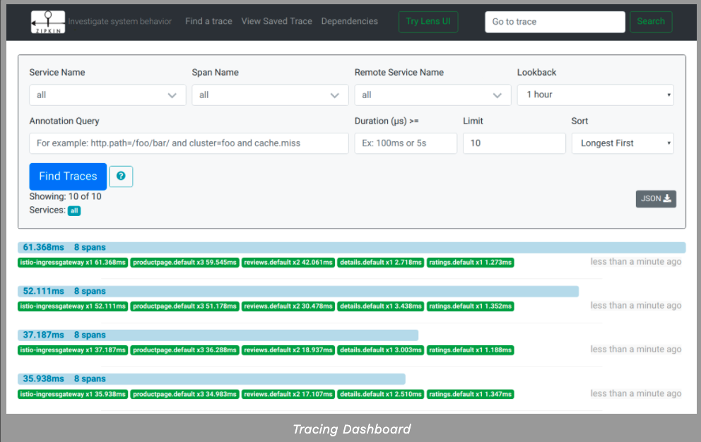
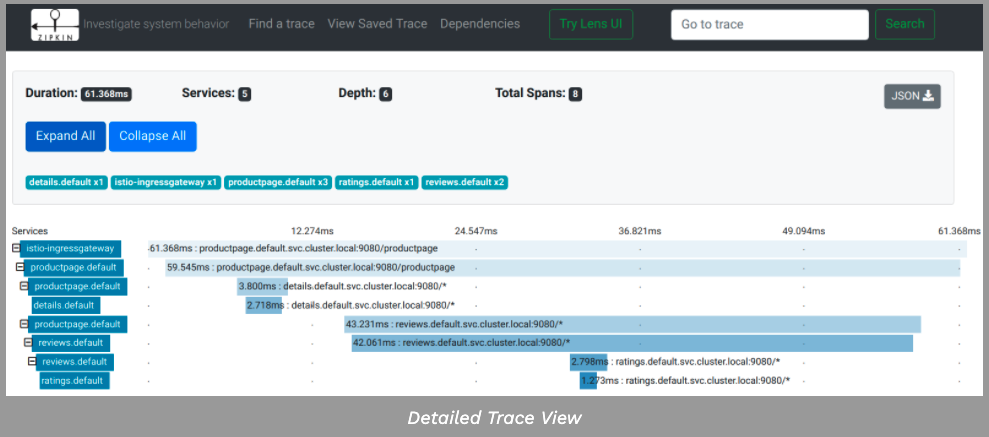

完成此任务后，您将了解如何让应用程序参与使用Zipkin进行跟踪，而不考虑用于构建应用程序的语言、框架或平台。

该任务使用Bookinfo示例作为示例应用程序。

要了解Istio如何处理跟踪，请访问该任务的概述。

#### 1. 准备工作

- 在demo/test环境中设置`--set values.tracing.enabled=true` 和 `--set values.tracing.provider=zipkin` 安装选项去开启开箱即用。

- 在生产环境中引用已经存在的Zipkin实例，然后设置`--set values.global.tracer.zipkin.address=<zipkin-collector-service>.<zipkin-collector-namespace>:9411` 安装选项。

2. 部署Bookinfo案例


#### 2. 访问dashboard

```shell
$ istioctl dashboard zipkin
```

#### 3. 使用Bookinfo案例产生追踪

1. 当Bookinfo应用处于运行状态时，访问`http://$GATEWAY_URL/productpage` 一次或更多次去产生追踪信息

去查看追踪数据，你必须发送请求到你的服务， 这请求的数量依靠于你Istio的案例速率 是当安装istio的时候设置的，默认的速率是1%。 在第一次追踪可见之前你需要至少发送100个请求。 使用如下命令，发送100个请求到productpage服务。

```shell
$ for i in `seq 1 100`; do curl -s -o /dev/null http://$GATEWAY_URL/productpage; done
```

2. 查看Dashboard如下图所示：



3. 在顶部点击最近的追踪，去查看最近到/productpage请求的详情




4. 这个追踪是由一系列的spans组成，每个spancs相对应于一个Bookfinfo服务， 在执行/productpage请求或者内部istio组进行调用，比如`istio-ingressgateway`

5. 清空本实验

- 移除任何istioctl进程

```shell
$ killall istioctl
```