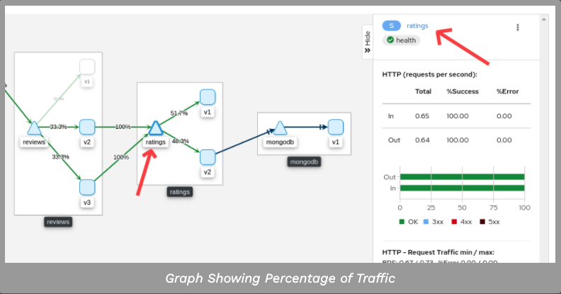
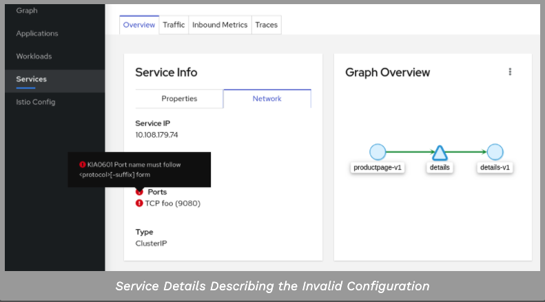

这个任务向你展示了如何可视化你的网格的不同方面。

作为该任务的一部分，您将安装Kiali add-on并使用基于web的图形用户界面来查看网格和Istio配置对象的服务图。最后，使用Kiali公共API以可消费JSON的形式生成图形数据。

该小节仍然使用Bookinfo案例

#### 1. 准备工作

下列指令是假设你没有通过istioctl 安装kiali的情况下执行：

##### 1.1 创建密钥

创建一个密钥在istio的名称空间，用于认证Kiali。

首先,定义您想要使用的凭证Kiali用户名和密码。

- 当提示的时候输入Kiali用户名

```shell
$ KIALI_USERNAME=$(read -p 'Kiali Username: ' uval && echo -n $uval | base64)
```

- 当提示的时候输入Kiali密码

```shell
$ KIALI_PASSPHRASE=$(read -sp 'Kiali Passphrase: ' pval && echo -n $pval | base64)
```

- 假如你使用Z shell, zsh，使用如下命令定义凭据

```shell
$ KIALI_USERNAME=$(read '?Kiali Username: ' uval && echo -n $uval | base64)
$ KIALI_PASSPHRASE=$(read -s "?Kiali Passphrase: " pval && echo -n $pval | base64)
```

- 创建密钥，运行如下命令

```shell
$ NAMESPACE=istio-system
$ kubectl create namespace $NAMESPACE
```

```shell
$ cat <<EOF | kubectl apply -f -
apiVersion: v1
kind: Secret
metadata:
  name: kiali
  namespace: $NAMESPACE
  labels:
    app: kiali
type: Opaque
data:
  username: $KIALI_USERNAME
  passphrase: $KIALI_PASSPHRASE
EOF
```

2. 通过istioctl进行安装

- 在创建Kiali 密钥后，通过如下命令进行安装

```shell
$ istioctl manifest apply --set values.kiali.enabled=true
```

>[warning]这个任务不讨论Jaeger Grafana。如果你已经安装在您的集群和你想看看Kiali集成,您必须将附加参数传递给istioctl命令,例如:
```shell
istioctl manifest apply \
    --set values.kiali.enabled=true \
    --set "values.kiali.dashboard.jaegerURL=http://jaeger-query:16686" \
    --set "values.kiali.dashboard.grafanaURL=http://grafana:3000"
```

#### 2. 产生一个service graph

1. 去校验在你的集群中服务是否运行，执行如下命令

```shell
$ kubectl -n istio-system get svc kiali
```

2. 确定你的Bookinfo URL

3. 发送流量到网格，有以下三个选项

- 在浏览器中访问 http://$GATEWAY_URL/productpage

- 使用如下命令多次
```shell
$ curl http://$GATEWAY_URL/productpage
```

- 假如你安装了watch命令，持续的发送请求

```shell
$ watch -n 1 curl -o /dev/null -s -w %{http_code} $GATEWAY_URL/productpage
```

4. 打开kiali UI，在kubernetes环境中执行如下命令

```shell
$ istioctl dashboard kiali
```

5. 登陆kiali后如下所示


6. 点击显示bookinfo名称空间的graph


7. 要查看度量的摘要，请选择图中的任何节点或边，以在右侧的summary details面板中显示其度量的详细信息。

8. 从`Graph Type`的下拉框中选择graph类型。 分别有`App, Versioned APP, Workload, Service`类型。

- 应用图类型聚合所有版本的应用程序到一个图节点。下面的例子展示了一个`reviews`节点代表三个版本的review程序。


- 版本应用图表类型为每个版本的应用程序显示一个节点,但所有版本的一个特定的应用程序组合在一起。下面的例子显示了包含三个节点的评论组框代表了三个版本的评审程序


- 工作负载图显示了每个工作负载的节点类型在你的服务网格。这个图表类型不要求您使用应用程序和版本标签,这样如果您选择不使用这些标签在你的组件,这是您将使用的图表类型。


- 服务图表类型显示一个节点为每个服务在你的网格但不包括所有应用程序和工作负载图


#### 3. 检查Istio的配置

要查看有关Istio配置的详细信息，请单击左侧菜单栏上的应用程序、工作负载和服务菜单图标。下面的屏幕截图显示了Bookinfo应用程序的信息:


#### 4. 创建权重的路由

您可以使用Kiali加权路由向导来定义路由到两个或多个工作负载的请求流量的特定百分比。

1. 查看bookinfo 图形的`Versioned app graph`

- 在Display的下拉菜单中确定你选择的`Requests Percentage`， 去看路由到每个工作流的百分比

- 在Dispaly的下拉菜单中确定你选择的`Service Nodes`去查看服务节点


2. 通过单击ratings service(三角形)节点，将焦点放在bookinfo图中的ratings服务上。注意，额定值服务流量均匀地分布到两个额定值工作负载v1和v2(50%的请求路由到每个工作负载)。



3. 点击侧面面板中的`ratings`链接，进入`ratings`服务的服务视图

4. 从这个`Action`下拉菜单中，选择`Create Weighted Routing` 去访问权重路由向导


5. 拖动滑动条指定的百分比流量路由到每个工作负载。ratings-v1,将其设置为10%;ratings-v2将它设置为90%。


6. 点击创建按钮，创建新的路由

7. 在左边的导航栏单击`Graph`回到bookinfo图

8. 向bookinfo应用程序发送请求。例如，要发送一个请求每秒，你可以执行这个命令，如果你有`watch`安装在你的系统:

```shell
$ watch -n 1 curl -o /dev/null -s -w %{http_code} $GATEWAY_URL/productpage
```

9. 几分钟后你会发现流量比例将反映新的流量路线,从而确认你的新交流量线是成功路由流量请求ratings-v2总量的90%。


#### 5. 校验Istio的配置

Kiali可以验证您的Istio资源，以确保它们遵循正确的约定和语义。在您的Istio资源配置中检测到的任何问题都可以标记为错误或警告，这取决于错误配置的严重程度。

为一个无效的配置服务的端口名称,看看Kiali报告验证错误。

1. 改变details服务的端口名称，http改成foo

```shell
$ kubectl patch service details -n bookinfo --type json -p '[{"op":"replace","path":"/spec/ports/0/name", "value":"foo"}]'
```

2. 通过左边的导航栏中的服务，导航到服务列表

3. 从名称空间的下拉菜单中选择bookinfo 

4. 注意到显示在配置列中的一个错误。


5. 在名字列点击`Details`链接

6. 悬停在错误图标来显示一个工具提示描述错误



7. 改变正确端口名称为http配置并返回bookinfo回到正常状态

```shell
$ kubectl patch service details -n bookinfo --type json -p '[{"op":"replace","path":"/spec/ports/0/name", "value":"http"}]'
```


#### 6. 查看和编辑Istio YAML配置


Kiali提供YAML编辑器查看和编辑Istio配置资源。YAML编辑器还将提供验证消息。

1. 创建Bookinfo目的规则

```shell
$ kubectl apply -f samples/bookinfo/networking/destination-rule-all.yaml
```

2. 在左边的导航栏点击`Istio config`导航到Istio的配置列表

3. 从`Namespace`下拉菜单中选择bookinfo.

4. 在错误和警告的图标上可以看出有几个配置问题


5. 将鼠标悬停在`configuration`列，可以看到附加的详细信息


6. 在名字上点击`details`链接

7. 可以看到警告省中显示有几个校验失败的


8. 点击YAML查看下目标规则资源的YAML信息

9. 那些高亮的行就是校验失败的


10. 悬停在黄色图标查看工具提示信息,告知您的验证检查,触发了警报。为更多的细节在警告的原因和如何解决它,查找验证Kiali验证页面上的警告消息。


11. 悬停在红色图标查看工具提示信息,告知您的验证检查,引发错误。为更多的细节在错误的原因和如何解决它,查找Kiali验证页面上的验证错误消息。


12. 删除目标规则返回bookinfo回到原来的状态。

```shell
$ kubectl delete -f samples/bookinfo/networking/destination-rule-all.yaml
```

#### 7. 清空本实验

如果你没有计划任何后续任务,删除和Kiali Bookinfo示例应用程序从你的集群。

1. 删除Bookinfo应用程序,请参阅Bookinfo清理指令。

2. 删除从Kubernetes Kiali环境,消除所有组件与应用程序app= Kiali标签

```shell
$ kubectl delete all,secrets,sa,configmaps,deployments,ingresses,clusterroles,clusterrolebindings,customresourcedefinitions --selector=app=kiali -n istio-system
```